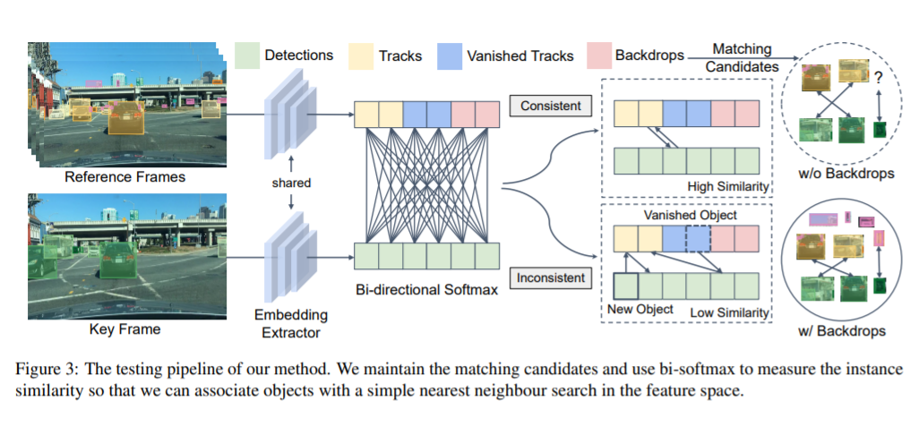

# Quasi-Dense Similarity Learning for Multiple Object Tracking

- [Paper](https://arxiv.org/abs/2006.06664)
- [Official Repo](https://github.com/SysCV/qdtrack)
- [Paper with Codes Page](https://paperswithcode.com/paper/quasi-dense-instance-similarity-learning)
- [MOT Dataset](https://motchallenge.net/)
- [BDD100K Dataset](https://bair.berkeley.edu/blog/2018/05/30/bdd/)
- [Waymo Dataset](https://waymo.com/open/)
- [TAO Dataset](https://taodataset.org/)

## Abstract 

- Similarity Learning: It is closely related to regression and classification, but the goal is to learn a similarity function that measures how similar or related two objects are.

- Currently models are using Sparse Ground Truth Matching as their training objective which ignores a lot of info. regions in the image

- Aim is to involve similarity learning

- Quasi-Dense Similarity Learning densely samples hundreds of region proposals for contrastive learning which aims to learn representations such that similar samples stay close to each other, while dissimilar ones are far apart.

- Observations made include that at inference time the feature space admits a simple nearest neighbout search

- It outperforms all existing methods on MOT, BDD100K, Waymo and TAO tracking benchmarks

## 1. Introduction

- MOT is a fundamental problem as is evident by rising self driving cars etc.

- Older MOT methods used tracking-by-detection where they detect objects frame by frame and associate them to a class based on instance similarity.

- Newer works have shown we can use spatial proximity between objects in consecutive frames (using IoUs or center distances) if objects are accurately detected in the first place which can help us associate objects.

- However problems arise when the object is occluded or crowded, to curb this methods like motion estimation where we determine motion vectors by looking at adjacent frames and displacement regression.

- We constrain our search regions to be local neighbourhoods to avoid distractions due to surrounding images.

- We also use object appearence similarity as a secondary result to restrenghten our beliefs about particular associations or track in case some object vanishes.

- So why are humans able to indentify identical objects immediately while computers struggle? Well the paper **conjectures** that this might be because while training image and object info. might not be fully used.

--- 

### Figure 1

- Re-identification(reID) is the process of associating images or videos of the same person taken from different angles and cameras

- All 4 approaches indicate different ways used. The first 3 regard using similarity learning as a later activity or use sparse ground truth bounding boxes as training samples.

---

- In the real world it's highly unlikely that you'll find indentical looking objects in an image so the model if trained properly should be able to distinguish objects which are similar and have or lack some features from older frames.

- A trick employed is using many bounding boxes, the ones closer to the actual bounding box give positive examples while the ones far apart act as negative samples.

- The paper employs quasi dense contrastive learning wherein we take an image, split it into 100s of region of interests and match those between a pair of images. Using this it learns a metric with contrastive loss which essentially means it uses the positive examples feeds it into the network, gets an output, calculates its *distance* from an object of the same class and then contrasts this from a negative example. The exact mathematical formula is as follows - 

- These quasi dense samples are able to cover most info. regions giving more box examples and hard negatives.

- One simple approach was to use a handful of ground truth labels. However the paper uses another approach which enhances similarity learning. Since each sample has many positive samples on the original image we can extend out contrastive learning process to account for those multiple forms which makes quasi-dense learning feasible. So each sample is trained to distinguish all proposals on the other image simultaneously.

- Apart from looking for similarity MOT needs to look for false positives, id switches, new appeared objects and terminated tracks.

---
### How to Tackle Missing Targets - 

- We include backdrops
- We also include the unmatched objects which remain in the last frame to match them
- We also use a bidirectional softmax to ensure bidirectional consistency.

### How to Tackle Multiple Targets - 

- We use duplicate removal to remove multiple targets and filter out matching candidates

---

- Quasi-dense contrastive learning can be used on top of pre-existing detectors such as R-CNNs or YOLO.

- The paper uses it on top of Faster R-CNN while applying a light weight embedding extractor and residual connections in the network.

---
### Benchmarks Attained by the Model - 

- 68.7 MOTA on MOT17 at 20.3 FPS with no external data
- 10 points MOTA increase and significantly reduces the number of ID switches on BDD100K and Waymo datasets

## 2. Related Work

- Recent focus in MOT is on the tracking-by-detection paradigm. The given approaches present different methods to estimate the instance similarity between detected objects and previous tracks, then associate objects as a bipartite matching problem.

### Location and Motion in MOT

- In crowded scenes spatial proximity fails while it works in less crowded frames to associate objects between successive frames.
- Earlier models use to detect objects and track displacement separtely. Methods such as Kalman Filter which uses multiple measurements over time to produce estimates over time in data with noise, Optical Flow which is the distribution of apparent velocities of movement of brightness pattern in an image, and displacement regression.
- Detect & Track was the first work which jointly optimizes both the tasks of detection and tracking. It predicts object displacement in consecutive frames using the [Viterbi Algorithm](https://en.wikipedia.org/wiki/Viterbi_algorithm).
- Tracktor directly uses a detector as a tracker
- CenterTrack & Chained-Tracker predict the object displacements with pair-wise inputs to associate the objects.
- The above mentioned models are good but need to built further to be usable such as the need for an extra re-identification model which will make the frameworks more complex.

### Appearence Similarity in MOT

- Some models use an independent model or add an extra embedding head to the detector for end to end training to leverage the instance appearence similarity which strengthens tracking of the same object from one frame to the other while also giving us the power to reidentify vanished objects.
- Still the basic underlying similarity learning process is the same i.e. they use the cosine distance. So they use a n-classes classification problem where n represents the total number of classes in which we have to classify the objects or use the triplet loss function (visual below).

- Since triplet loss only compares one image to two others it's hard to extend this to larger datasets. Hence MOT doesn't fully leverage Similarity Learning on the other hand QDTrack learns instance similarity from dense-connected contrastive pairs and associate objects present in the feature space with a simple nearest neighbour search (visual below). 

### Constrastive Learning

- It is very successful in self-supervised representation learning which is a way of training a deep learning model with labels inherently obtained from the data itself.
- It is still not very used to get instance similarity in MOT.
- The paper essentially takes dense matched quasi-dense samples and supervises them with multiple positive contrastive learning.
- Unlike image-level constrastive methods out method allows for multiple positive training while in other methods there is only one positive target.

## 3. Methodology

- Proposed Quasi-dense matching to learn the feature embedding space to associate identical objects and distinguish different objects for online multiple object tracking.
- Dense matching is matching between box candidates at all pixels. Dense image matching takes an alternative approach to obtain a corresponding point for almost every pixel in the image. Rather than searching the entire image for features, it will compare two overlapping images row by row. Essentially, this reduces the problem to a much simpler one-dimensional search.

- In Quasi-Dense matching one matches box candidates by only considering the potential object candidates at information regions.
- In Sparse Matching the user only considers ground truth labels as matching candidates while learning object association

### Quasi Dense Matching Comprises of the following - 
---
### 3.1 Object Detection

- The method in the paper can be coupled with most existing detectors for end to end training such as R-CNNs, YOLO etc.
- In the paper they've chosen [Faster R-CNN with Feature Pyramid Network (FPN)](https://towardsdatascience.com/review-fpn-feature-pyramid-network-object-detection-262fc7482610).
- Faster R-CNN comprises of 2 stages. It uses Region Proposal Network (RPN) to generate Region of Interests (RoIs). It then localizes and classifies the regions to obtain semantic labels and locations. 

- Then FPN exploits lateral connections to build the top-down feature pyramid and tackles the scale-variance problem.
- A multi-task loss function is used to optimize the network given by - 

### 3.2 Quasi-dense Similarity Learning

- Region proposals are used to learn instance similarity with Quasi-dense matchmaking.

---

Figure 2

- We have a chosen Key and randomly picked Reference Frame from it's temporal neighbourhood.
- The neighbourhood is defined using a neighbour distance which lies in an interval k. For the paper k belonged to the set [-3, 3].
- Then we apply the subsequently explained process

---

- Our RPN generates ROIs from the 2 images, and then we use ROI Align (It is an operation for extracting a small feature map from each RoI in detection and segmentation based tasks) to obtain their feature maps from different levels in FPN according to their scales. So we get feature maps for different RoIs made by the RPN.
- We then add an extra light weight embedding head in parallel to the original bounding box head which extracts features from each RoI. 
- Two thresholds α1 and α2 are defined. An IoU more than α1 is defined to say that the ROI is positive to an object while one less than α2 is said to say that the ROI is negative to an object. The authors used the values 0.7 and 0.3 respectively.
- So if the two regions associate to the same object then ROI is +ve else it is -ve, since if they associate to the same object they will have a higher IoU and vice-a-versa.
- Non-parametric softmax with cross entropy is used to optimize the feature embeddings.

- v here is the feature embeddings for the training sample, k+ for the positive target and k- for the negative target. This is then averaged over all training examples.
- Now we extend this relation to dense matchin between RoIs on the image pair so each sample in image 1 is matched to each sample in image 2. This allows us to learn instance similarity. 
- Since there are multiple training targets we extend the above equation as follows - 

- On closer inspection however you'll again notice that the postive terms are undercounted, how? well for each positive samples you count multiple negative samples due to the summation in the denominator of the expression.
- So we first recompute out first equation over one positive example as follows - 

- Then we begin to consider the multiple positive scenarios as follows - 

- The paper authors also decided to use L2 loss as an auxiliary loss to try to constrain the logit magnitude and cosine similarity. The relation uses c to be 1 when the ROI is positive to an object else it is 0.

- Finally we can bring all out losses under one roof to optimize our network as follows - 

### 3.3 Object Association

It is not at all trivial how we're going to use all this stuff we've built so far to track objects. Heck, does it even make sense aren't all we doing just some boring maths?

Let's try to make some sense of what we are doing

- Suppose you have an object and you get no or more than one target, what do you do? Your nearest neighbour logic will cease to work, so for the current model to work you need to have only one target in the matching candidates

- Due to various issues such as false positives, id switches, newly appeared objects (ofcourse they do when you drive for instance) and terminated tracks all make it much more non trivial to understand the tracking process or even build one in the first place.

- Now the authors come to our rescue. They observed that their inference strategy worked well which includes ways of maintaining matching candidates and measuring instance similarity can mitigate these problems.

---
### Figure 3

- We extract embeddings from the reference and key frames.
- They pass through a bi-directional softmax and we get to know the instance similarity between the object and the matching candidate.
- The higher the instace similarity the closer it will be in the feature space and the easier it will be to find using simple nearest neighbour search.
- We notice in the last part of the image when BackDrops are not in place we miss out on some objects while with BackDrops they are easy to track.
---

***Bi-directional Softmax***

- Our inference strategy is mainly to use Bi-directional matching in the embedding space.

- A high score using the bi-softmax will satisfy bi-directional consistency. Going back to our nearest neighbour technique, the two matched objects should be nearest neighbours in the embedding space. This is the instance similarity in some sense. Using this instance similarity you can easily associate objects using nearest neighbour search.
- The mathematical formulation is as follows - 

- Here we assume there are N detected objects in frame t with feature embeddings n, and M matching candidates with feature embeddings m from the past x frames. This formula returns the similarity f between the objects and their matching candidates.

***No Target Cases***

- The objects which don't have a target in the feature space such as newly appeared objects, vanished tracks and false positives should not be matched to any candidates. 
- The bi-softmax does the job for us as it does not give these objects any bi-directional consistency leading to low matching scores. 
- If incase we detect a new object and it has high detection confidence then we can start off a new track for it but what we've been following so far would just drop the object instead.
- The authors put forward their point that even thought these can lead to false positives they can still be useful in several regions where they match others.
- These unmatched objects were termed as backdrops and kept in the matching process by the authors.
- Some experiments have also shown that backdrops were able to reduce number of backdrops.

***Multi-Target Classes***

- Other top models use [None Maximum Suppression (NMS)](https://towardsdatascience.com/non-maximum-suppression-nms-93ce178e177c) for intra class removal.

- But the problem arises that some objects might be in the same location but have different classes and usually only one of them is out required prediction. 

- This process can boost the object recall and increase our [mean Average Prediction (mAP)](https://towardsdatascience.com/map-mean-average-precision-might-confuse-you-5956f1bfa9e2)

- This process has a downfall of creating duplicate feature embeddings to deal with which we do inter class duplicate removal using NMS.

- The IoU threshold for NMS is 0.7 for objects with high confidence (larger than 0.5) and 0.3 for objects with lower detection confidence (lower than 0.5).