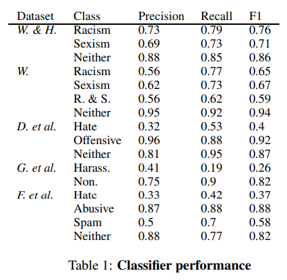

# Racial Bias in Hate Speech and Abusive Language Detection Datasets

[Original Paper](https://arxiv.org/abs/1905.12516)

## Abstract

- The authors essentially recognised the inherent bias in the types of dataset mentioned in titles. 
- When dealing with tweets with african american english they are much more likely to be recognised as hateful over american english tweets.
- This bias can be detrimental as then the trained models will flag an African American User much more just because of the English they use when the sentiment might not be as negative as the model thinks.
- This means this may flag the victims of abuse instead of protecting them

## Introduction

- Some works have shown bias in trained models which are caused due to bias in the data the model trains on.
- Bias may reduce the accuracy rendering the model unable to detect abuse and in the worst case might even discriminate against the very people it was built to protect.
- The paper studies models trained on Standard American English (SAE) and African American English (AAE) datasets all of which use data scraped from Twitter.
- The authors used Bootstrap Sampling (Bootstrapping is any test or metric that uses random sampling with replacement (e.g. mimicking the sampling process), and falls under the broader class of resampling methods) to estimate how many tweets fall in each class according to the model.
- Bias was observed in all classes with AAE tweets being flagged more than SAE tweets.
- Keeping out certain words does reduce the bias significantly however it still persists and is present in the trained model.

## Related Works 

- Bias often causes wrong predictions as seen with facial recognition technology. They perform far worse for darker-skinned women as compared to a white male face. This is due to the lack of data for the former when compared to the latter.
- Research also shows in unsupervised learning the embeddings learnt also contain biases which persist even after removal.
- Youtube captioning system also works far worse for women.
- Many classifiers even classify AAE as non english.
- Although it is difficult to find a perfect model but still we should be concerned if the model has inherent bias against a group by the virtue of the data it was trained on.
- Annotation Scheme and Annotator Identity manipulation also helps kin reducing bias.
- Google's Perspective API Classifier is an example which was trained on Wikipedia talk comments and poorly classifies even a simple sentence referring to homosexuals in a normal fashion as toxic since a majority of data which it was trained on was biased and saw those words in the wrong light.
- Even Hate speech detectors work very poorly when female identity terms are present.

## Research Design

### Hate Speech & Abusive Language Datasets

- The paper focuses on Twitter Datasets which is widely used for these purposes

***Waseem and Hory 2016***
- 130k tweets containing one of 17 hateful terms.
- Annotated by themselves
- Reviewes by a 25 year old womemn studying gender studies and a nonactivist feminist.
- 16,849 tweets labelled either racist, sexist or neither
- To account for bias Waseem relabelled 2876 tweets
- Annotated by feminist and anti-racism activists
- Fourth category of racism and sexism was added
- Dataset has about 6909 tweets

***Davidson et al. (2017)***
- Collected tweets having words from the [HateBase](https://hatebase.org/).
- To avoid bias crowdworkers were instructed not to straight away label something based on word phrases rather use the overall tweet and inferred context.
- 24,783 annotated tweets are present which are classified as either hate speech, offensive language or neither.

***Golbeck et al. (2017)***
-  Tweets were selected using ten keywords and phrases related to anti-black racism, Islamophobia, homophobia, anti-semitism, and sexism.
- Initial coding scheme involved multiple classes such as threats or hate speech.
- Finally the authors went with a binary approach of harassment or non-harassment label.
- 20,360 Handlabelled tweets are present.

***Founta et al. (2018)***
- Randomly chose tweets having words from the HateBase lexicon.
- They criticized old works where labels were added in an ad hoc fashion
- They first allowed each tweet to lie in multiple classes.
- They then analyzed overlaps between classes and ended up with 4 classes abusive, hateful, spam and normal.
- Their database of 91,951 tweets is used in this paper.

### Training Classifiers
- A classifier is trained for each dataset
- Logistic Regression is used along with bag-of-word features. In bag-of-word model, a text is represented as the bag of its words, disregarding grammar and even word order but keeping multiplicity.
- While using more complex models might be better but recall the problem was with our dataset and biases will inevitably creep in.
- Embeddings are not used as some research has shown bias in pretrained embeddings.
- Each tweet is preprocessed by removing URLS and Mentions and replacing them with placeholders.
- We form a TF-IDF matrix out of each dataset allowing a maximum of 10000 features. TFIDF, short for term frequency–inverse document frequency, is a numerical statistic that is intended to reflect how important a word is to a document in a collection or corpus.
- 80% of the dataset is used for training while rest is used for validation.
- Model is trained using [Stratified 5-Fold Cross Validation](https://machinelearningmastery.com/k-fold-cross-validation/).
- Grid search is performed over different regularization set parameters to find best performing model.
- For each dataset we find model with best F1 score and we train it using all data. 
- Their performace on the 20% held out validation set is recorded in Table 1.
- It was noticed hate speech and harassment is difficult to detect which is understandable since it can be easily confused as offensive text.  

